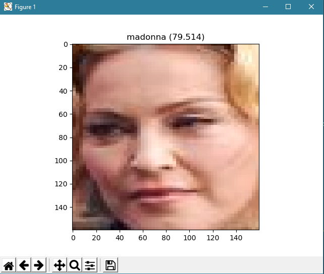

<h1 align="center">Face Recognition and Classification Using FaceNet and MTCNN</h1>
<a href="#">
  <div align="center">
    
  </div>
</a> 

[](#)
[](#)
[](https://github.com/saadhaxxan/Face-Classification-Using-FaceNet-and-Keras/fork)
[](https://github.com/saadhaxxan/Face-Classification-Using-FaceNet-and-Keras/issues)
[](#)

## Usage

Installing requirements and dependencies
```
git clone https://github.com/saadhaxxan/Face-Classification-using-FaceNet-and-MTCNN.git
cd Face-Classification-using-FaceNet-and-MTCNN
pip install --user -r requirements.txt
```

Extracting Faces from Dataset using MTCNN
```
python extract_faces.py
```

Extracting Face Embeding from the Dataset using FaceNet Model.
```
python face_embeddings.py
```

Classifying Faces to their respective classes using Linear Support Vector Machine
```
python face_classification.py
```

## Author
You can get in touch with me on my LinkedIn Profile:

#### Saad Hassan
[](https://www.linkedin.com/in/saadhaxxan)

You can also follow my GitHub Profile to stay updated about my latest projects: [](https://github.com/saadhaxxan)

If you liked the repo then kindly support it by giving it a star ⭐!

If you find any bug in the code or have any improvements in mind then feel free to generate a pull request.

If you face any issue, you can create a new issue in the Issues Tab and I will be glad to help you out.

## LICENSE
- MIT (2021)
